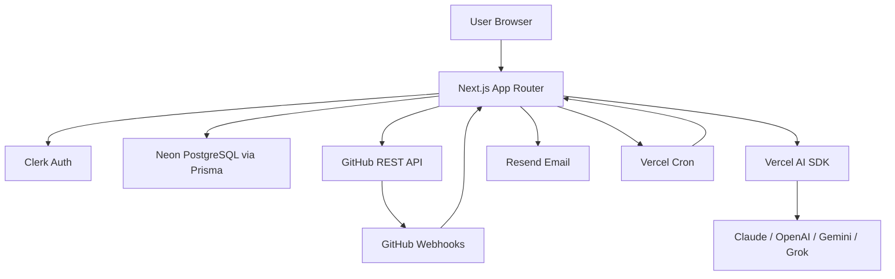

# PaceUp

> **Built for teams that actually want to finish.**

PaceUp is an AI-powered project leader for student teams. It eliminates the leadership vacuum that kills most group projects — automatically assigning roles, tracking commits, running daily standups, detecting conflicts, and reviewing code so teams can focus on building.

---

## Features

| Feature | Description |
|---------|-------------|
| **AI Role & Task Assignment** | Submits a project brief → AI reads all member skill profiles → assigns each person a role and a specific task list |
| **GitHub Integration** | Links your repo, registers webhooks, ingests every commit and PR automatically |
| **Commit-to-Task Matching** | AI matches each commit to its nearest task with HIGH/MEDIUM/LOW confidence |
| **Conflict Detection** | Alerts when two members edit the same file on the same day |
| **Daily Standups** | Members submit what they did, what they plan, and any blockers — all in one place |
| **Nag Loop** | Overdue tasks and missing standups trigger in-app notifications and emails |
| **AI Code Reviews** | Group creator triggers a review on any DONE task — AI reads the commit diffs and returns feedback |
| **BYOK Model** | Users bring their own API key (Claude, OpenAI, Gemini, Grok) — PaceUp never charges for AI |
| **Health Score** | Live project health gauge based on task completion percentage |
| **Notification Bell** | Real-time in-app notifications with read/unread state |

---

## Architecture



---

## Tech Stack

| Layer | Technology |
|-------|-----------|
| Framework | Next.js 14 (App Router, TypeScript, Server Components) |
| Database | Neon (PostgreSQL) via Prisma ORM |
| Auth | Clerk |
| Email | Resend |
| AI Routing | Vercel AI SDK (unified across all providers) |
| Hosting | Vercel |
| Styling | Tailwind CSS + shadcn/ui (Doom Neon theme) |
| GitHub | GitHub REST API + Webhooks |

---

## Getting Started

### 1. Clone and install

```bash
git clone https://github.com/1712Jeswin/PaceUp.git
cd PaceUp
npm install
```

### 2. Set up environment variables

```bash
cp .env.local.example .env.local
```

Fill in all required values (see `.env.local.example` for descriptions):

- **Neon** — `DATABASE_URL`
- **Clerk** — publishable key, secret key, webhook secret
- **AI Key Encryption** — `AI_KEY_SECRET` (32-char random string)
- **Resend** — `RESEND_API_KEY`, `RESEND_FROM_EMAIL`
- **GitHub** — `GITHUB_WEBHOOK_SECRET`
- **Cron** — `CRON_SECRET`
- **App URL** — `NEXT_PUBLIC_APP_URL`

### 3. Push the database schema

```bash
npx prisma db push
```

### 4. Set up Clerk webhooks

In your Clerk dashboard → Webhooks → add an endpoint:
- URL: `https://your-domain.com/api/webhooks/clerk`
- Events: `user.created`, `user.updated`

### 5. Run the dev server

```bash
npm run dev
```

---

## Project Structure

```
/app
  /(auth)               — Clerk sign-in / sign-up
  /dashboard
    /group/[id]         — Group dashboard
    /group/[id]/tasks   — Task board
    /group/[id]/commits — Commit feed + PR tracker
    /group/[id]/standup — Daily standup
    /group/[id]/settings — Group settings (GitHub link)
    /new-group          — Create / join group
    /profile            — Skill profile viewer
    /profile/setup      — Profile setup wizard
    /settings/keys      — AI key vault (BYOK)
  /join/[code]          — Public group join page

/app/api
  /webhooks/clerk       — Clerk user sync
  /webhooks/github      — GitHub push + PR ingestion
  /ai/assign-tasks      — AI role + task assignment
  /ai/review-code       — AI code review
  /cron/nag             — Daily nag loop (Vercel Cron)
  /groups/[id]/settings — GitHub repo link/unlink
  /standup              — Standup CRUD
  /notifications        — Notification fetch + mark read
  /tasks/[id]           — Task status update
  /conflicts/[id]/resolve — Mark conflict resolved

/components             — Reusable UI components
/lib
  db.ts                 — Prisma singleton
  ai.ts                 — Vercel AI SDK routing
  crypto.ts             — AES-256 key encryption
  github.ts             — GitHub REST API helpers
  conflict-detector.ts  — File conflict detection
  nag.ts                — Overdue + standup detection + email
/prisma
  schema.prisma         — Full database schema
/types
  index.ts              — Shared TypeScript interfaces
```

---

## Phase Roadmap

| Phase | Status | What it includes |
|-------|--------|-----------------|
| Phase 1 — MVP Core | ✅ Complete | Auth, groups, skill profiles, project briefs, AI task assignment, task board, BYOK key vault |
| Phase 2 — Intelligence Layer | ✅ Complete | GitHub integration, commit tracking, conflict detection, standups, nag loop, AI code reviews, notifications |
| Phase 3 — Collaboration Layer | 🔲 Planned | Mentor access, Gantt timeline, analytics heatmap, submission portal, handoff summaries |
| Phase 4 — Scale and Polish | 🔲 Planned | Stripe billing, institution admin, hackathon leaderboard, public project showcase |

---

## API Reference

All API routes return:

```json
{ "success": boolean, "data": any, "error": string }
```

| Method | Route | Auth | Description |
|--------|-------|------|-------------|
| POST | `/api/webhooks/clerk` | Svix sig | Sync Clerk users to DB |
| POST | `/api/webhooks/github` | HMAC-SHA256 sig | Ingest commits + PRs |
| GET | `/api/cron/nag` | CRON_SECRET | Daily nag loop |
| POST | `/api/ai/assign-tasks` | Clerk | AI role + task assignment |
| POST | `/api/ai/review-code` | Clerk (creator) | AI code review |
| GET/PUT/DELETE | `/api/groups/[id]/settings` | Clerk (creator) | GitHub repo link/unlink |
| GET/POST | `/api/standup` | Clerk | Daily standup |
| GET | `/api/notifications` | Clerk | Fetch notifications |
| POST | `/api/notifications/mark-read/[id]` | Clerk | Mark notification read |
| POST | `/api/conflicts/[id]/resolve` | Clerk (member) | Resolve file conflict |

---

## Security

- All `/dashboard/*` and `/api/*` routes (except webhooks and cron) require a valid Clerk session
- GitHub PATs are stored encrypted with AES-256
- AI API keys are stored encrypted with AES-256
- GitHub webhooks verified with HMAC-SHA256 (`X-Hub-Signature-256`)
- Cron route protected with `CRON_SECRET` header check
- User IDs always derived from server-side Clerk session — never trusted from client

---

## Contributing

This is a personal project by [Jeswin](https://github.com/1712Jeswin). Issues and PRs welcome.

---

*PaceUp — Built for teams that actually want to finish.*
